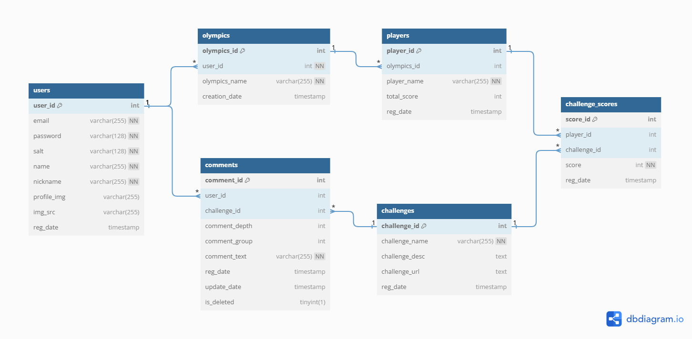

### 1. 프로젝트 개요

- **프로젝트 명**: 오피스 올림픽
- **목적**: 사무실에서 간단한 운동을 통해 직장인들이 건강한 생활 습관을 형성하고, 업무 중에 즐거움을 찾을 수 있도록 하는 웹 서비스
- **문제점 해결**: 장시간 앉아 있는 생활로 인한 건강 문제를 해결하고, 직장 내 활력을 불어넣어 스트레스를 해소하는 것을 목표

### 2. 타겟 페르소나

- **직장인:** 사무실에서 근무하며 간단한 운동을 통해 건강 관리를 하고 싶은 사람들
- **팀장**: 팀 **아이스 브레이킹**을 위해 팀원들과 함께 올림픽을 개최하고 싶은 사용자.

### 3. 핵심 기능

1. **홈페이지**: 전체 리더보드와 챌린지 목록 제공, 사용자들이 참여할 수 있는 챌린지 소개
2. **회원가입 및 로그인**: 이메일, 비밀번호를 통해 회원가입 및 로그인
3. **올림픽 설정**: 올림픽을 개최하기 위해 필요한 데이터 입력: 올림픽명, 올림픽 참가 인원 수, 플레이어 수, 플레이어의 닉네임
4. **챌린지 참여 및 기록 제출**: 각 챌린지에 대한 상세 정보 제공, 챌린지 참가 후 기록을 제출하여 리더보드에 반영
5. **마이 페이지**: 프로필 관리, 내가 좋아요 누른 챌린지 조회, 비밀번호 변경, 회원 탈퇴

### **추가기능**

1. **커뮤니티 기능**: 챌린지에 댓글, 좋아요를 눌러 의견을 공유

### 4. 유저 저니 맵

| **여정 단계**     | **발견**                          | **등록**                      | **게임 생성 및 플레이**                       | **결과 확인 및 공유**                  |
|-------------------|-----------------------------------|-------------------------------|----------------------------------------------|----------------------------------------|
| **고객 행동**     | 건강 활동 & 아이스 브레이킹을 위한 ‘오피스 올림픽’ 서비스 접속 | 호스트가 올림픽을 생성하고 정보 입력   | 플레이어 설정, 올림픽 생성, 챌린지별 결과 기록, 점수와 순위 확인 | 챌린지 완료 후 최종 결과 확인, 동료와 순위 비교 및 공유 |
| **고객의 필요**   | 간단한 운동으로 팀 분위기 개선 필요, 오프라인 팀 활동 결과 공유 | 간편한 등록 절차, 안전한 개인정보 관리 | 손쉬운 플레이어 등록, 서비스에서 결과 관리, 간편한 사용법 | 팀 성취 자랑 및 공유, 새로운 올림픽 생성 초대 |
| **상호작용**      | 추천이나 웹 검색으로 서비스 접속     | 로그인/회원가입                | 올림픽 생성 및 설정, 챌린지 결과 입력, 리더보드 및 누적 결과 확인 | 최종 리더보드 및 챌린지별 순위 확인, 결과 공유 기능  |
| **고객의 감정**   | 🤔 (호기심), 🥳 (즐거움 기대)        | 😌 (안도감), 👍 (간편함)        | 🤩 (기대감), 😊 (편리함), 💪 (경쟁 의욕)    | 🏆 (성취감), 🎉 (동료와의 즐거움)       |
| **백스테이지**     | 참여 유도 홈페이지 UI              | 보안 강화된 가입/로그인 절차      | 간단한 올림픽 생성폼 제공, 챌린지 결과 관리 기능 개발 | 점수 변환 알고리즘 구현, 결과 공유 및 시각화 제공 |
| **전략**         | 챌린지의 재미를 강조하는 홈페이지    | 간편한 등록 절차 제공            | 명확한 UX, 정확한 점수 관리 기능           | 올림픽 순위 페이지, 소셜 미디어 공유 기능 |

### 5. 기술 스택

- **프론트엔드**: HTML, CSS, JavaScript, Vue.js
- **백엔드**: Java Spring Boot, MyBatis
- **데이터베이스**: MySQL
- **API 문서화**: Swagger

### 6. 시스템 아키텍처

- **프론트엔드와 백엔드 분리**: Vue.js를 사용한 프론트엔드와 Spring Boot 기반의 백엔드가 REST API를 통해 통신합니다.
- **데이터 관리**: MySQL을 이용해 사용자, 올림픽, 챌린지, 점수 등을 관리합니다.

### 7. 주요 API 명세서

| **우선순위** | **기능**             | **설명**                               | **메소드** | **REST API**                  |
|--------------|----------------------|----------------------------------------|------------|-------------------------------|
|              | **auth**             | **인증 관련 API**                      |            | **/auth**                     |
| 1            | 로그인 폼            | 로그인 폼을 반환함                      | GET        | /auth/login                   |
| 2            | 로그인               | 사용자가 이메일과 비밀번호로 로그인함     | POST       | /auth/login                   |
| 3            | 로그아웃             | 사용자를 로그아웃 처리함                | POST       | /auth/logout                  |
| 4            | 회원가입 폼          | 회원가입 폼을 반환함                    | GET        | /auth/register                |
| 5            | 회원가입             | 사용자 회원가입 요청 처리               | POST       | /auth/register                |
|              | **accounts**         | **유저 관련 API**                      |            | **/accounts**                 |
| 6            | 마이 페이지 조회      | 특정 사용자의 마이 페이지 정보를 반환함   | GET        | /accounts/:user_id            |
| 7            | 정보 수정            | 사용자의 정보를 수정함                  | PUT        | /accounts/:user_id            |
| 8            | 회원 탈퇴            | 사용자의 계정을 삭제함                  | DELETE     | /accounts/:user_id            |
| -            | 사용자 조회          | 전체 사용자 목록 조회                  | GET        | /accounts                     |
|              | **olympics**         | **올림픽 관련 API**                    |            | **/olympics**                 |
| 9            | 올림픽 팀 설정       | 새로운 올림픽 팀을 생성하고 설정함       | POST       | /olympics/team                |
| 10           | 팀 설정 폼 반환      | 팀 설정 폼 데이터를 반환함              | GET        | /olympics/team/form           |
| 11           | 팀 삭제              | 특정 올림픽 팀을 삭제함                | DELETE     | /olympics/team/{olympic_id}   |
|              | **challenges**       | **챌린지 관련 API**                    |            | **/challenges**               |
| 12           | 챌린지 세부 정보 조회 | 특정 챌린지의 세부 정보를 반환함        | GET        | /challenges/:challenge_id     |
| 13           | 챌린지 기록 제출      | 챌린지 결과 데이터를 제출함             | POST       | /challenges/:challenge_id/record |
| 14           | 챌린지 리더보드 조회  | 특정 챌린지의 리더보드를 조회함         | GET        | /challenges/:challenge_id/rank |
| -            | 좋아요 기능          | 특정 챌린지에 대한 좋아요를 처리함       | POST       | /challenges/:challenge_id/like |
| -            | 댓글 작성            | 특정 챌린지에 대한 댓글을 작성함         | POST       | /challenges/:challenge_id/comment |
| -            | 댓글 수정            | 특정 챌린지에 대한 댓글을 수정함         | PUT        | /challenges/:challenge_id/comment |
| -            | 댓글 삭제            | 특정 챌린지에 대한 댓글을 삭제함         | DELETE     | /challenges/:challenge_id/comment |
|              | **main**             | **메인 페이지 관련 API**               |            | **/main**                     |
| 15           | 메인 페이지          | 메인 페이지 데이터를 반환함 (챌린지 목록 조회 및 리더보드 업데이트) | GET | /main                         |

### 8. ERD 다이어그램

- 
- **users**: 사용자 정보를 저장하는 테이블로, 이메일, 비밀번호, 닉네임 등의 정보를 포함합니다.
- **olympics**: 올림픽 팀 정보와 호스트 사용자 정보를 저장합니다.
- **players**: 올림픽 참가 플레이어 정보를 저장합니다.
- **challenges**: 챌린지 정보와 설명을 저장합니다.
- **challenge_scores**: 챌린지 참여 기록 및 점수를 저장합니다.
- **comments & likes**: 챌린지에 대한 댓글과 좋아요를 저장합니다.

### 9. [목업](https://app.uizard.io/p/24d8f3b4)
    

### 10. 기대 효과

- **건강 증진**: 직장인들이 업무 중에도 간단한 운동을 통해 건강을 관리할 수 있음
- **팀워크 향상**: 올림픽 게임을 통해 동료들 간의 소통과 협력 강화.
- **스트레스 해소**: 게임 요소를 도입해 업무 스트레스를 줄이고 즐거움을 제공