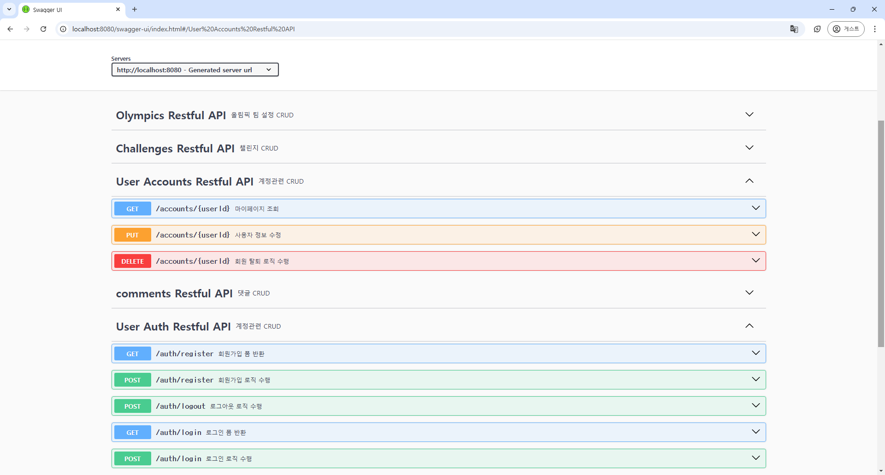

# Auth 관련 로직 구현 리뷰

## 목차
- [주요 코드 구조 및 로직](#주요-코드-구조-및-로직)
- [작업 내역](#작업-내역)
- [각 파일의 내용](#각-파일의-내용)
- [비밀번호 해싱 처리 방법](#\※-비밀번호-해싱-처리-방법)

## 주요 코드 구조 및  로직

### Swagger API 이미지

- **회원 정보 관리**: `User` 모델과 `UserDao` 인터페이스를 통해 데이터베이스와 연동하며, 주요 메서드로 `insertUser`, `selectUser`, `selectById`, `deleteUser`, `modifyUser` 등이 구현되어 있습니다.
- **비밀번호 암호화**: `UserServiceImpl`에서 `HashUtil`을 사용해 비밀번호를 SHA-256으로 해싱하고 `salt`를 적용하는 방식이 적절히 설정되었습니다.
- **이미지 파일 검증**: `FileConfirm`을 이용해 이미지 파일 확장자를 확인하고, UUID 기반 파일명을 사용해 저장하는 로직이 구현되어 있어 보안과 유효성 검증 측면에서 유리합니다.

## 작업 내역

- `AuthController.java`
- `AccountController.java`
- `FileConfirm.java`
- `HashUtil.java`
- `User.java`
- `UserDao.java`
- `UserMapper.xml`
- `UserServiceImpl.java`

## 각 파일의 내용

- controller   
    `AuthController`에서는 인증과 회원 관련 기본 CRUD 기능을 담당하고 있으며, 세션과 파일 업로드를 통해 사용자 정보를 관리하는 구조로 구성되어 있습니다.

    - **로그인 폼 반환 (GET /auth/login)**   
        로그인 페이지로 이동하는 간단한 응답을 반환합니다.
    - **로그인 (POST /auth/login)**   
        사용자의 이메일과 비밀번호를 검증하여, 일치하는 사용자가 있으면 세션에 사용자 정보를 저장하여 로그인 상태로 만듭니다.   
        세션 고정 공격 방지를 위해 기존 세션을 무효화하고 새로운 세션을 생성합니다.   
        성공 시 사용자 이름을 포함한 로그인 성공 메시지를 반환하며, 실패 시에는 오류 메시지를 반환합니다.
    - **로그아웃 (POST /auth/logout)**   
        세션을 무효화하여 로그아웃 처리하고, 로그아웃 성공 메시지를 반환합니다.
    - **회원가입 폼 반환 (GET /auth/regist)**   
        회원가입 페이지로 이동하는 간단한 응답을 반환합니다.
    - **회원가입 (POST /auth/regist)**   
        사용자가 입력한 이메일, 비밀번호, 이름, 프로필 이미지를 받아 새로운 계정을 생성합니다.   
        profile_img는 선택 사항으로, 파일 업로드를 통해 이미지도 처리할 수 있습니다.   
        회원가입 성공 시 성공 메시지를 반환하며, 이미 존재하는 사용자일 경우 실패 메시지를 반환합니다.    

    `AccountController`는 사용자 계정 관련 CRUD 기능을 제공하며, 세션을 통해 인증된 사용자의 정보를 관리하는 구조로 구성되어 있습니다.
    
    - **마이페이지 조회 (GET /accounts/{id})**  
        주어진 사용자 ID에 해당하는 사용자 정보를 조회합니다.  
        사용자 정보가 존재하면 해당 정보를 반환하며, 존재하지 않는 경우 다른 응답을 반환할 수 있습니다.
    
    - **회원 정보 수정 (PUT /accounts/{id})**  
        주어진 사용자 ID의 정보를 업데이트합니다.  
        이메일, 비밀번호, 이름, 프로필 이미지 파일을 `RequestParam`으로 받아 수정하며, 성공 시 성공 메시지를 반환하고 실패 시 오류 메시지를 반환합니다.
    
    - **회원 탈퇴 (DELETE /accounts/{id})**  
        주어진 사용자 ID에 해당하는 계정을 삭제합니다.  
        세션을 통해 현재 로그인한 사용자의 ID를 확인하여 본인의 계정만 삭제할 수 있도록 하고, 삭제 성공 시 성공 메시지를 반환합니다.

    
- service   
    `UserServiceImpl.java` 파일에서 회원가입 로직과 파일 업로드가 구현되어 있으며, 주요 기능은 다음과 같습니다.
    
    - **회원가입 로직**:
        - 비밀번호 암호화를 위해 `HashUtil`의 `generateSalt`와 `hashPassword` 메서드를 사용하여 비밀번호를 SHA-256으로 암호화하고, 사용자 정보에 `salt`와 `hashedPassword`를 설정합니다.
        - 프로필 이미지가 있을 경우, `FileConfirm.isValidImageFile`을 사용하여 이미지 확장자를 검증하고, `UUID`를 사용해 파일 이름을 생성한 후, 서버에 저장하는 방식입니다.
    - **파일 검증**:
        - 파일 확장자가 `jpg`나 `png`가 아닌 경우 예외를 발생시킵니다.
- dao   
    `UserDao.java` 파일은 `User` 객체와 관련된 데이터베이스 접근 메서드를 정의한 인터페이스로, 주요 메서드는 다음과 같습니다.
    
    - **메서드**:
        - `insertUser(User user)`: 회원 가입
        - `selectUser(String email)`: 이메일로 회원 정보 조회
        - `selectById(int id)`: 사용자 ID로 회원 조회
        - `selectAccounts()`: 전체 회원 정보 조회
        - `deleteUser(int id)`: 회원 삭제
        - `modifyUser(User user)`: 회원 정보 수정
- mapper   
    `UserMapper.xml` 파일의 주요 구조는 다음과 같습니다.

    - **회원 가입**: `insertUser`는 `users` 테이블에 새로운 사용자 데이터를 삽입하며, 자동 생성된 `user_id`를 매핑합니다.
    - **회원 정보 조회**: `selectUser`는 이메일로 사용자 정보를 조회하고, `selectById`는 사용자 ID로 특정 필드만 조회합니다.
    - **회원 삭제**: `deleteUser`는 사용자 ID로 사용자를 삭제합니다.
    - **회원 정보 수정**: `modifyUser`는 이메일과 이름, 프로필 이미지를 수정합니다.
    - **전체 회원 조회**: `selectAccounts`는 모든 사용자 정보를 조회합니다.
- dto   
    `User.java` 파일의 주요 구조는 다음과 같습니다.
    
    - **필드**: `user_id`, `email`, `password`, `salt`, `name`, `profile_img`, `img_src`, `reg_date` 등의 멤버 변수를 갖고 있습니다.
    - **생성자**: 매개변수 있는 생성자와 기본 생성자가 정의되어 있으며, 각 필드에 대해 `getter`와 `setter` 메서드가 구현되어 있습니다.

## ※ 비밀번호 해싱 처리 방법

### 고민 사항

- **보안 강화 필요성**: 비밀번호는 민감한 사용자 정보이므로, 데이터베이스에 평문으로 저장할 경우 보안에 심각한 위협이 될 수 있습니다. 따라서 보안을 강화하기 위해 해싱(Hashing) 기법을 사용하여 안전하게 저장할 필요가 있습니다.
- **현업 적용 가능성**: 실제 현업에서 널리 사용되고 권장되는 해싱 방법을 선택하고자 했습니다.

### 선택한 해싱 알고리즘

 **SHA-256**과 **Bcrypt** 알고리즘을 검토하였습니다. Bcrypt는 속도 조절이 가능해 해싱 작업에 시간 복잡도를 추가할 수 있어 보안성이 뛰어나다는 장점이 있습니다. 그러나 고민 끝에 최종적으로 **SHA-256** 알고리즘을 선택했으며, 그 이유는 다음과 같습니다.

- **KISA 권장 알고리즘**: **SHA-256**은 한국인터넷진흥원(KISA)에서 권장하는 해싱 알고리즘 중 하나로, 안전하고 신뢰할 수 있는 암호화 방식입니다. Bcrypt 역시 비밀번호 저장에 많이 사용되는 알고리즘이지만, KISA 권장 사항을 준수하기 위해 SHA-256을 최종적으로 선택하였습니다.
- **현업 적용 가능성**: SHA-256은 많은 기업 및 조직에서 보편적으로 사용하는 알고리즘으로, 현업에서도 널리 적용되는 방식입니다. SHA-256을 선택함으로써 향후 유지보수와 관리 측면에서 표준성을 지키는 것이 더 적합하다고 판단하였습니다.

### 구현 방식

 **SHA-256 해싱과 Salt 처리**

1. **SHA-256 해싱**: Java의 `MessageDigest` 라이브러리를 활용하여 SHA-256 해싱을 수행합니다.
2. **Salt 추가**: 해싱 시 단순 해싱보다 보안성을 강화하기 위해 사용자별 고유의 Salt 값을 추가하여 해싱합니다. 이 Salt 값은 데이터베이스의 `salt` 컬럼에 저장됩니다.

 **MyBatis를 사용한 해싱 처리**

- MyBatis Mapper를 통해 해싱된 비밀번호 값을 데이터베이스에 저장합니다.
- 저장 시 Salt를 함께 사용하여, 동일한 비밀번호라도 사용자마다 다른 해시 값을 가지도록 처리합니다.
