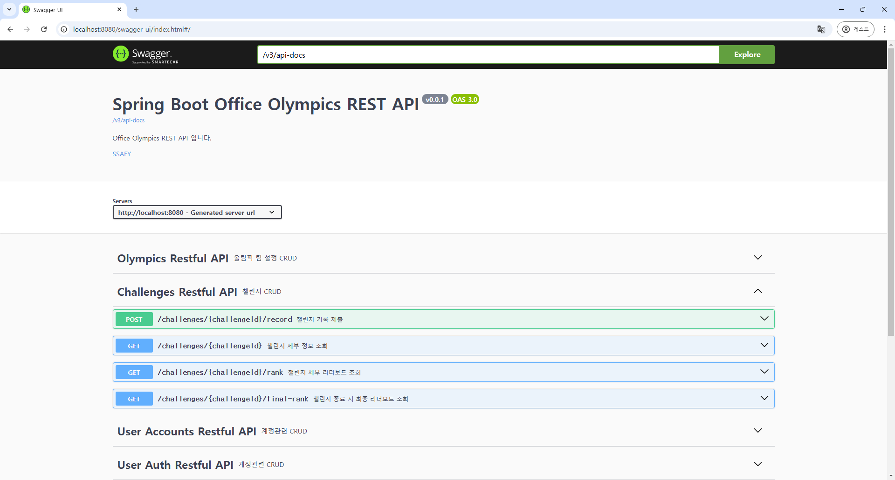

# Comments 관련 로직 구현 리뷰

## 목차
- [주요 코드 구조 및 로직](#주요-코드-구조-및-로직)
- [작업 내역](#작업-내역)
- [각 파일의 내용](#각-파일의-내용)

## 주요 코드 구조 및 로직

### Swagger API 이미지

- **댓글 관리**: `ChallengeController`와 `CommentsService`를 통해 챌린지별 댓글 작성, 조회, 수정, 삭제 기능을 구현했습니다.
- **데이터베이스 연동**: `CommentsDao`와 `CommentsMapper.xml`을 이용해 MyBatis로 댓글 데이터 조작을 수행합니다.

## 작업 내역

- `ChallengeController.java`
- `CommentsDao.java`
- `CommentsMapper.xml`
- `Comments.java` (DTO)
- `CommentsService.java`
- `CommentsServiceImpl.java`

## 각 파일의 내용

- controller    
    `ChallengeController`는 챌린지의 댓글 작성, 조회, 수정, 삭제 기능을 처리합니다.

    - **댓글 조회 (GET /challenges/{challengeId}/comments)**  
        특정 `challengeId`에 대한 댓글 목록을 반환합니다.

    - **댓글 작성 (POST /challenges/{challengeId}/comments)**  
        사용자가 댓글을 작성하며, `userId`와 `commentText`를 JSON 형식으로 전달합니다.

    - **댓글 수정 (PUT /challenges/{challengeId}/comments/{commentId})**  
        특정 `commentId`의 댓글 내용을 수정합니다.

    - **댓글 삭제 (DELETE /challenges/{challengeId}/comments/{commentId})**  
        특정 `commentId`의 댓글을 삭제합니다.

- service   
    `CommentsServiceImpl` 파일에서는 댓글 조회, 작성, 수정, 삭제 로직이 구현되어 있습니다.

    - **댓글 조회 로직**  
        - `getComments` 메서드를 통해 `challengeId` 기반의 댓글 목록을 반환합니다.

    - **댓글 작성 로직**  
        - `insertComment` 메서드를 통해 댓글을 데이터베이스에 추가합니다.

    - **댓글 수정 로직**  
        - `modifyComment` 메서드를 통해 특정 댓글의 내용을 갱신합니다.

    - **댓글 삭제 로직**  
        - `deleteComment` 메서드를 통해 특정 댓글을 삭제합니다.

- dao   
    `CommentsDao`는 댓글과 관련된 데이터베이스 연산을 정의하는 인터페이스입니다.

    - **주요 메서드**:
        - `getComments`: 특정 챌린지의 댓글 목록을 반환
        - `findUserComments`: 특정 `challengeId`에 사용자가 작성한 댓글 여부 확인
        - `insertComment`: 댓글을 추가
        - `modifyComment`: 댓글 내용을 수정
        - `deleteComment`: 댓글을 삭제

- mapper   
    `CommentsMapper.xml` 파일은 MyBatis SQL 매핑 파일로, 댓글 조회, 작성, 수정, 삭제 쿼리를 포함합니다.

    - **댓글 조회 쿼리**: `getComments`는 `challengeId` 기반으로 댓글 목록을 반환합니다.
    - **작성한 댓글 확인 쿼리**: `findUserComments`는 사용자가 작성한 댓글 여부를 확인합니다.
    - **댓글 추가 쿼리**: `insertComment`는 새로운 댓글을 삽입합니다.
    - **댓글 수정 쿼리**: `modifyComment`는 특정 댓글의 내용을 갱신합니다.
    - **댓글 삭제 쿼리**: `deleteComment`는 특정 댓글을 삭제합니다.

- dto   
    - **Comments.java**: `commentId`, `userId`, `challengeId`, `commentText`, `regDate`, `updateDate`를 포함하여 댓글 정보를 나타냅니다.
