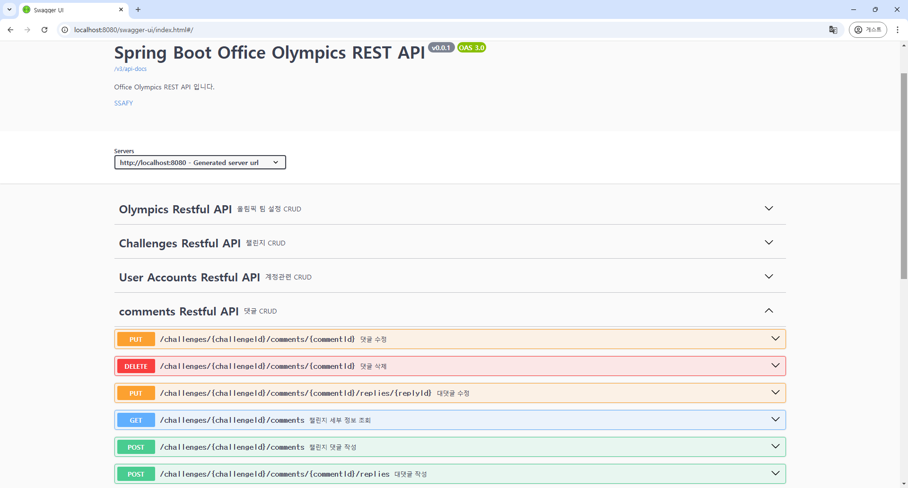

# Comments 관련 로직 구현 리뷰

## 목차
- [주요 코드 구조 및 로직](#주요-코드-구조-및-로직)
- [작업 내역](#작업-내역)
- [각 파일의 내용](#각-파일의-내용)

## 주요 코드 구조 및 로직

### Swagger API 이미지

- **댓글 관리**: `CommentsController`와 `CommentsService`를 통해 챌린지별 댓글 작성, 조회, 수정, 삭제 기능을 구현했습니다.
- **데이터베이스 연동**: `CommentsDao`와 `CommentsMapper.xml`을 이용해 MyBatis로 댓글 데이터 조작을 수행합니다.

## 작업 내역

- `CommentsController.java`
- `CommentsDao.java`
- `CommentsMapper.xml`
- `Comments.java` (DTO)
- `CommentsService.java`
- `CommentsServiceImpl.java`

## 각 파일의 내용

- controller    
    `ChallengeController`는 챌린지의 댓글 작성, 조회, 수정, 삭제 기능을 처리합니다.

    - **댓글 조회 (GET /challenges/{challengeId}/comments)**  
        특정 `challengeId`에 대한 댓글 목록을 반환합니다.

    - **댓글 작성 (POST /challenges/{challengeId}/comments)**  
        사용자가 댓글을 작성하며, `userId`와 `commentText`를 JSON 형식으로 전달합니다.

    - **댓글 수정 (PUT /challenges/{challengeId}/comments/{commentId})**  
        특정 `commentId`의 댓글 내용을 수정합니다.

    - **댓글 삭제 (DELETE /challenges/{challengeId}/comments/{commentId})**  
        특정 `commentId`의 댓글을 삭제합니다.

    - **대댓글 작성 (POST /challenges/{challengeId}/comments/{commentId}/replies)**  
        특정 `commentId`에 대댓글을 작성합니다.  
        - 입력 데이터: `commentText`, `userId`  
        - 처리 로직: 원댓글 ID를 `commentGroup`에 저장하고, `commentDepth`를 1로 설정합니다.

    - **대댓글 수정 (PUT /challenges/{challengeId}/comments/{commentId}/replies/{replyId})**  
        특정 `replyId`의 대댓글 내용을 수정합니다.

- service   
    `CommentsServiceImpl` 파일에서는 댓글 조회, 작성, 수정, 삭제 로직이 구현되어 있습니다.

    - **댓글 조회 로직**  
        - `getComments` 메서드를 통해 `challengeId` 기반의 댓글 목록을 반환합니다.

    - **댓글 작성 로직**  
        - `insertComment` 메서드를 통해 댓글을 데이터베이스에 추가합니다.

    - **댓글 수정 로직**  
        - `modifyComment` 메서드를 통해 특정 댓글의 내용을 갱신합니다.

    - **댓글 삭제 로직**  
        - `deleteComment` 메서드는 댓글 삭제 시 연관된 대댓글을 확인합니다.  
          대댓글이 존재하면 댓글을 "삭제된 메시지입니다"로 표시(soft delete).  
          모든 대댓글이 삭제된 경우, 원댓글도 삭제됩니다.
    - **트랜잭션 관리**  
        - `insertComment`, `modifyComment`, `deleteComment` 등 주요 메서드에서 트랜잭션을 활용하여 데이터 일관성을 유지합니다.
        - 예외 발생 시 모든 작업이 롤백됩니다.

- dao   
    `CommentsDao`는 댓글과 관련된 데이터베이스 연산을 정의하는 인터페이스입니다.

    - **주요 메서드**:
        - `getComments`: 특정 챌린지의 댓글 목록을 반환
        - `findUserComments`: 특정 `challengeId`에 사용자가 작성한 댓글 여부 확인
        - `insertComment`: 댓글을 추가
        - `modifyComment`: 댓글 내용을 수정
        - `deleteComment`: 댓글을 삭제

- mapper   
    `CommentsMapper.xml` 파일은 MyBatis SQL 매핑 파일로, 댓글 조회, 작성, 수정, 삭제 쿼리를 포함합니다.

    - **댓글 및 대댓글 조회 쿼리**: `getComments`는 `commentGroup`, `commentDepth`, `createdAt`으로 정렬하여 계층 구조를 유지하며 댓글과 대댓글을 조회합니다.
    - **작성한 댓글 확인 쿼리**: `findUserComments`는 사용자가 작성한 댓글 여부를 확인합니다.
    - **댓글 추가 쿼리**: `insertComment`는 새로운 댓글을 삽입합니다.
    - **댓글 수정 쿼리**: `modifyComment`는 특정 댓글의 내용을 갱신합니다.
    - **댓글 삭제 쿼리**: `deleteComment`는 특정 댓글을 삭제합니다.
    - **soft delete 쿼리**: `updateCommentText`는 댓글 텍스트를 "삭제된 메시지입니다"로 갱신하고, `is_deleted` 값을 1로 설정합니다.
    - **대댓글 작성 쿼리**: `insertReply`는 `commentGroup`에 원댓글 ID를 저장하여 대댓글을 삽입합니다.
    - **대댓글 수정 쿼리**: `modifyReply`는 특정 대댓글의 내용을 갱신합니다.

- dto   
    - **Comments.java**: `commentId`, `userId`, `challengeId`, `commentDepth`, `commentGroup`, `commentText`, `regDate`, `updateDate`, `isDeleted`를 포함하여 댓글 정보를 나타냅니다.

## ※ 댓글 로직 설계

### 설계 시 고려 사항

1. **계층 구조 관리**:
 - 댓글과 대댓글은 계층 구조를 가집니다.이 계층을 효율적으로 관리하기 위해 commentGroup 필드에 원댓글의 commentId를 저장하는 방식을 도입하였습니다.
 - 대댓글은 commentDepth로 구분하며, commentGroup은 그룹화를 지원합니다.

2. **삭제 처리**:
 - 댓글 삭제 시, 대댓글이 존재할 경우 "삭제된 메시지입니다"로 대체합니다.
 - 대댓글이 모두 삭제된 경우, 원댓글도 삭제 처리합니다.

3. **조회 효율성**:
 - 대댓글은 commentGroup으로 그룹화하고, reg_date를 기준으로 정렬하여 조회합니다.
 - 하나의 쿼리로 댓글과 대댓글을 동시에 가져올 수 있도록 설계했습니다.

4. **데이터 무결성**:
 - 본인만 댓글 및 대댓글 수정/삭제 가능하며, 삭제된 댓글은 수정 불가하도록 처리했습니다.

### commentGroup을 활용한 구조의 장점
1. **간단한 데이터 모델**:
 - commentGroup과 commentDepth만으로 댓글 및 대댓글 계층 표현이 가능했으며, 별도 테이블이 필요하지 않게 되었습니다.

2. **효율적인 정렬**:
 - 댓글 및 대댓글은 commentGroup으로 묶여 reg_date로 정렬하도록 하여 대댓글이 많은 경우에도 성능 저하를 최소화하였습니다.

3. **확장 가능성**:
 - 향후 메타데이터(예: 좋아요, 신고)를 추가하기 용이합니다.