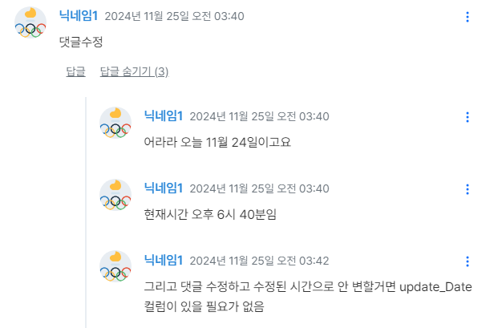

# OfficeOlympics TroubleShootingLog

## 목차
- [OfficeOlympics TroubleShootingLog](#officeolympics-troubleshootinglog)
  - [목차](#목차)
  - [1. Spring Boot와 Axios를 사용한 세션 관리 트러블슈팅 정리](#1-spring-boot와-axios를-사용한-세션-관리-트러블슈팅-정리)
  - [POST /challenges/{challengeId}/score](#2-post-challengeschallengeidscore)
  - [댓글/대댓글 2차 수정 시도 시 “삭제된 댓글은 수정할 수 없습니다.” 에러](#3-댓글대댓글-2차-수정-시도-시-삭제된-댓글은-수정할-수-없습니다-에러)
 
## 1. Spring Boot와 Axios를 사용한 세션 관리 트러블슈팅 정리

## **문제 정의**

1. **세션 유지 불가**:
    - 페이지 이동 또는 요청마다 `JSESSIONID`가 변경되면서 세션이 유지되지 않음.
2. **401 Unauthorized 오류**:
    - 서버가 클라이언트 요청을 인증할 수 없으며, 세션 식별이 실패.

<details>
<summary><h2>문제 원인과 해결</h2></summary>
<div markdown="1">

## 1. 문제 원인

이번 프로젝트는 **세션 기반 인증**을 사용하여, 브라우저의 CORS 정책이 더 엄격하게 적용됨.

### 2. 해결

#### ~~1) 프론트엔드에서 `withCredentials` 누락~~
#### 프론트에서는 설정을 해두었음
- **원인**:
Axios 요청에서 `withCredentials: true`가 누락되면 브라우저가 쿠키(`JSESSIONID`)를 요청에 포함하지 않음.
- **해결**:
Axios 기본 설정에서 `withCredentials: true`를 추가하여 모든 요청에 쿠키를 포함하도록 설정.

---

#### **2. 서버의 CORS 설정 문제**

- **원인**:
    - 서버의 CORS 설정이 클라이언트 도메인에서 온 요청을 허용하지 않거나, `allowCredentials: true` 설정이 없을 경우 쿠키가 전송되지 않음.
    - `allowedOrigins`가 `*` 로 설정되면 `withCredentials`와 함께 사용할 수 없음.
- **해결**:
CORS 설정에서 `allowCredentials(true)`와 클라이언트 도메인(`http://localhost:5173`)을 명시적으로 설정.

```java
@Override
public void addCorsMappings(CorsRegistry registry) {
    registry.addMapping("/**")
        .allowedOrigins("http://localhost:5173") // 정확한 클라이언트 도메인
        .allowedMethods("GET", "POST", "PUT", "DELETE", "OPTIONS")
        .allowCredentials(true) // 쿠키 허용
        .allowedHeaders("*") // 모든 헤더 허용
        .maxAge(3600); // Preflight 요청 캐싱
}
```

---

#### **3. `ServletContextInitializer`를 사용한 세션 설정**

- **`ServletContextInitializer`의 역할**:
    - 세션 쿠키의 기본 속성(HTTP 전용, Secure 등)을 설정하는 역할을 수행.
    - `HttpOnly`, `Secure`, `Path` 등 세션 쿠키 속성을 간단히 설정할 수 있음.
- **Spring Boot에서 사용 방법**:
`ServletContextInitializer`는 설정 클래스에 Bean으로 등록해야 합니다. Spring Boot가 시작될 때 초기화 코드를 실행하여 쿠키 속성을 설정합니다.

```java
import org.springframework.boot.web.servlet.ServletContextInitializer;
import org.springframework.context.annotation.Bean;
import org.springframework.context.annotation.Configuration;

@Configuration
public class SessionConfig {

    @Bean
    public ServletContextInitializer servletContextInitializer() {
        return servletContext -> {
            servletContext.getSessionCookieConfig().setHttpOnly(true); // HTTP 전용
            servletContext.getSessionCookieConfig().setSecure(false); // HTTPS 환경이 아니라면 false
        };
    }
}
```

#### **ServletContextInitializer로 설정 가능한 세션 속성**

1. **`setHttpOnly(true)`**:
    - JavaScript에서 쿠키에 접근하지 못하도록 설정하여 보안을 강화.
    - XSS(크로스 사이트 스크립팅) 공격 방지에 유용.
2. **`setSecure(false)`**:
    - HTTPS에서만 쿠키를 전송하도록 설정.
    - 로컬 개발 환경에서는 `false`로 설정.
3. **`setPath("/")`**:
    - 쿠키가 애플리케이션 전역 경로에서 유효하도록 설정.

---

#### **4. 브라우저 요청 검증**

- **문제**:
세션이 유지되지 않는 이유 중 하나는 브라우저가 쿠키를 요청에 포함하지 않는 경우입니다.
- **해결**:
**개발자 도구 > Network 탭**에서 요청 헤더와 응답 헤더를 확인:
    1. 요청에 `Cookie: JSESSIONID=...`가 포함되어야 함.
    2. 응답에 `Set-Cookie` 헤더가 포함되어야 함.

#### **예시 (정상 상태)**:

- **Request Headers**:
    
    ```
    Cookie: JSESSIONID=abcd1234efgh5678
    ```
    
- **Response Headers**:
    
    ```
    Set-Cookie: JSESSIONID=abcd1234efgh5678; Path=/; HttpOnly
    ```
    

---

#### **5. 추가 디버깅**

- 세션이 무효화되거나 쿠키가 새로 설정되는 원인을 파악하기 위해 로그를 추가합니다:

```java
System.out.println("Session ID: " + request.getSession().getId());
```

---

#### **최종 점검 사항**

1. **프론트엔드 Axios 설정**:
    - `withCredentials: true`가 모든 요청에 포함되도록 설정.
2. **서버 CORS 설정**:
    - `allowCredentials(true)`와 정확한 `allowedOrigins` 설정.
3. **ServletContextInitializer로 세션 속성 설정**:
    - `HttpOnly`, `Secure`, `Path` 등 속성을 정확히 설정.
4. **브라우저 쿠키 확인**:
    - 요청에 쿠키가 포함되고 응답에서 쿠키가 제대로 설정되는지 확인.
</div>
</details>

## 2. POST /challenges/{challengeId}/score

<details>
<summary><h3>KEVIN</h3></summary>
<div markdown="1">
	
### 문제 정의

 - TalendAPI 사용 시 아무 문제 없는 POST 요청이 프론트엔드에서 요청하면 500 서버 에러가 뜸
 - 요청 body
    
    ```json
    {
    "playerNames" : ["플레이어1", "플레이어2", "플레이어3"],
    "scores" : [10, 15, 20]
    }
    ```
    
 - 에러코드
    
    ```bash
    POST http://localhost:8080/challenges/1/score 500 (Internal Server Error)
    
    {timestamp: '2024-11-20T09:00:55.674+00:00', status: 500, error: 'Internal Server Error', trace: 'java.lang.IndexOutOfBoundsException: Index 3 out o…java.base/java.lang.Thread.run(Thread.java:840)\r\n', message: 'Index 3 out of bounds for length 3', …}
    error
    : 
    "Internal Server Error"
    message
    : 
    "Index 3 out of bounds for length 3"
    
    "java.lang.IndexOutOfBoundsException: Index 3 out of bounds for length 3
    	... 중략 ... 
    	**at com.olympics.mvc.model.service.ChallengeScoreServiceImpl.upsertScores(ChallengeScoreServiceImpl.java:51)**
    ```
    
 - 의문점…
    - 나는 플레이어 3명의 3개의 데이터를 보냈는데 왜 서버 쪽에서 Index 3 out of bounds for length 3 IndexOutOfBoundsException 에러가 뜨지?
    - 갑자기 플레이어가 늘어날 일이 없는데…
    - 플레이어 명이 겹친다면 nameToId가 문제 일으킬 수 도 있으나? 현재 우리 db에서는 플레이어 명이 겹치는 것도 없고…  참…. 모르겠단 말이다….

     ☞ 서로 다른 유저가 동일한 player의 이름을 지정했을 경우 에러 발생 / ScoreData에 for문을 돌릴 index 지정 범위를 `score.getPlayerId().size()`를 `score.getScores().size()`로 변경함 (24.11.26)

    ```java
	// 챌린지 결과 기록 (수정 전 코드)
	@Transactional
	@Override
	public boolean upsertScores(Score score) {
		// 이름을 ID로 변환
	    List<Integer> ids = challengeDao.nameToId(score.getPlayerNames());
	    score.setPlayerId(ids);

	    // 변환된 데이터를 insert에 사용 가능한 형태로 준비
	    List<Map<String, Object>> scoreData = new ArrayList<>();
	    for (int i = 0; i < score.getPlayerId().size(); i++) {
	        Map<String, Object> map = new HashMap<>();
	        map.put("challengeId", score.getChallengeId());
	        map.put("playerId", score.getPlayerId().get(i));
	        map.put("score", score.getScores().get(i));
	        scoreData.add(map);
	        System.out.println(scoreData.get(i));
	    }
	    
	    // challenge_id와 player_id에 대응하는 score_id가 있는지 확인
	    int isExist = challengeDao.findScoreId(scoreData);
	    
	    // 있으면 update, 없으면 insert 진행
	    if(isExist > 0) {
	    	int isUpdated = challengeDao.updateScore(scoreData);
	    	return isUpdated == 1;
	    } else {
	    	int isInserted = challengeDao.insertScore(scoreData);
	    	return isInserted == 1;
	    }
	}
    ```
</div>
</details>

<details>
<summary><h3>YES</h3></summary>
<div markdown="1">

### 문제 정의
- 챌린지 스코어 에러 확인사항
    1. 하얀배경으로 찍힌 콘솔 로그를 보면 전송은 잘 되었는데 `/challenges/{challengeId}/score` → `/challenges/{challengeId}/rank` 로 넘어가는것은 아직 구현이되지 않아 `/challenges/{challengeId}` 와 `/challenges/{challengeId}/comments` 두 API를 불러오는 화면으로 되돌아감 (당연하며, DB에는 점수가 잘 들어감)
    2. 근데 아래 에러 발생 살펴보니 현재 선택되어있는 곳 바로 윗 줄에 에러 발생 위치가 나옴 
        (url:”`/challenges/{challengeId}/comments`")
    3. comments DB 스키마가 바뀌었고 그에 따라 SQL문이 작성되어있는데 프로그램을 실행한 컴퓨터에서는 해당 DB 업데이트 사항이 반영되지 않아 없는 column을 계속 찾으니 500로그가 찍힌 것으로 판단 됨
- 결론 : **스키마, 데이터 업데이트하면 해결됩니다.**
.png)
.png)

- 스키마, 데이터 적용 이후
.png)
.png)
.png)
.png)

</div>
</details>

## 3. 댓글/대댓글 2차 수정 시도 시 “삭제된 댓글은 수정할 수 없습니다.” 에러

<details>
<summary><h3>KEVIN</h3></summary>
<div markdown="1">

# **현재 상황 및 개선 제안**

#### **버그 현상:**

- 답글 & 댓글 작성 (정상)
- 답글 & 댓글 첫 번째 수정 (정상)
- **답글 & 댓글 두 번째 수정 시도 시 "삭제된 댓글은 수정할 수 없습니다." 메시지 출력**

#### **버그 원인:**

```sql
<select id="checkDeleted" parameterType="map" resultType="int">
	SELECT COUNT(*) FROM comments
	**WHERE update_date IS NOT NULL**
	AND comment_id = #{commentId}
	AND user_id = #{userId};
</select>
```

- 현재 checkDeleted 메서드는 **update_date가 NULL이 아닌 모든 댓글을 삭제된 댓글로 간주**
- 금요일에 삭제 확인 로직에 대해서 함께 토의할 때 2차 수정을 할 수도 있다는 사실을 인지 못함. 이 부분을 내가 놓쳤다. ㅠ
    - 이로 인해 댓글/대댓글을 **1차 수정하면 update_date가 갱신**되어, 이후 **2차 수정이 불가능한 상황**이 발생.

#### 개선 제안:

1. **제안: is_deleted 컬럼 추가(?)**
    - 아래는 claude-3.5 sonnet의 제안임. 도움이 되길 ㅠ
    
    ---
    
    #### 댓글 수정 기능 개선 제안
    
    **1. 현재 문제점**
    
    1. `checkDeleted` 메서드가 `update_date` 존재 여부로 삭제 상태를 판단
    2. 댓글 수정 시 `update_date`가 갱신되어 재수정이 불가능한 상황 발생
    3. 실제 삭제된 댓글과 수정된 댓글을 구분할 수 없음
    
    **2. 개선 방안**
    
    - **2.1 데이터베이스 스키마 변경**
        
        ```sql
        ALTER TABLE comments ADD COLUMN is_deleted BOOLEAN DEFAULT FALSE;
        ```
        
    - **2.2 수정이 필요한 파일 및 코드**
        1. **CommentsMapper.xml의 checkDeleted 쿼리 수정**
            
            ```sql
            	<select id="checkDeleted" parameterType="map" resultType="int">
            		SELECT COUNT(*) FROM comments
            		WHERE update_date IS NOT NULL
            		AND comment_id = #{commentId}
            		AND user_id = #{userId};
            	</select>
            ```
            
            - **새로운 쿼리:**
                
                ```sql
                <select id="checkDeleted" parameterType="map" resultType="int">
                    SELECT COUNT(*) FROM comments
                    **WHERE is_deleted = TRUE**
                    AND comment_id = #{commentId}
                    AND user_id = #{userId};
                </select>
                ```
                
        2. **CommentsServiceImpl.java의 deleteCommentOrReply:85-91 메소드 수정**
            
            ```java
                        if (replyCount > 0) {
            
                        	Map<String, Object> params = new HashMap<>();
                        	params.put("commentId", commentId);
                        	params.put("commentText", "삭제된 메시지입니다");
                        	commentsDao.updateCommentText(params);
                        } else {
            ```
            
            - 새로운 코드:
                
                ```java
                Map<String, Object> params = new HashMap<>();
                params.put("commentId", commentId);
                params.put("commentText", "삭제된 메시지입니다");
                params.put("isDeleted", true);
                commentsDao.updateCommentText(params);
                ```
                
        3. **CommentsMapper.xml의 updateCommentText 쿼리 수정**
            
            ```sql
                <update id="updateCommentText" parameterType="Comments">
            		UPDATE comments
            		SET comment_text = #{commentText}, 
            				update_Date = NOW()
            		WHERE comment_id = #{commentId}
                </update>
            ```
            
            - 새로운 쿼리:
                
                ```sql
                <update id="updateCommentText" parameterType="map">
                    UPDATE comments
                    SET comment_text = #{commentText},
                        update_date = NOW(),
                        **is_deleted = #{isDeleted}**
                    WHERE comment_id = #{commentId}
                </update>
                ```
                
    
    **3. 기대 효과**
    
    1. 댓글 수정 기능의 정상 작동
    2. 삭제된 댓글과 수정된 댓글의 명확한 구분
    3. 데이터 관리의 정확성 향상
    4. 사용자 경험 개선
    
    **4. 구현 순서**
    
    1. DB 스키마 변경 (is_deleted 컬럼 추가)
    2. CommentsMapper.xml 수정
    3. CommentsServiceImpl.java 수정

</div>
</details>

<details>
<summary><h3>YES</h3></summary>
<div markdown="1">

#### 수정완료

1. 금요일 오후에 말한대로 is_deleted 컬럼 추가
   	- 기존 로직의 경우, 다 회 수정을 고려하지 않고 update_date의 null을 기준으로 판단하도록 한 것이 문제가 됨.
   	- 이에 is_deleted 컬럼을 flag로 설정하여 soft 삭제된 댓글인지에 대한 판단을 내릴 수 있도록 수정함.
3. 아래는 FE쪽 수정 필요 사항 발견   
    a. DML로 밀어넣은 댓글 중 대댓글들은 삭제 불가 (토글이 안생김)   
    b. **댓글 수정 시 수정된 시간으로 업데이트 안됨 + 시간 불일치 이슈 (차라리 서버에서 시간을 끌어오는건?)**
    
    

    <details>
	<summary><h4>원인 및 해결 방법 (KEVIN)</h4></summary>
	<div markdown="1">    

     - 서버에서 오는 날짜 데이터에 T 와 +00:00 가 포함되어 있어서 (2024-11-24T20:24:14.000+00:00) JavaScript가 이를 UTC 시간으로 해석
        - Comments.vue의 formatDate 함수를 다음과 같이 수정하면 됨
            
            ```jsx
            const formatDate = (date) => {
              if (!date) return '';
              
              // UTC 표시(+00:00)와 'T'를 제거하고 공백으로 대체
              const localDate = date.replace('T', ' ').replace(/\.[0-9]{3}\+00:00/, '');
              
              return localDate.replace(/([0-9]{4})-([0-9]{2})-([0-9]{2}) ([0-9]{2}):([0-9]{2}):[0-9]{2}/, 
                (match, year, month, day, hour, minute) => {
                  return `${year}년 ${month}월 ${day}일 ${hour}:${minute}`;
                });
            };
            ```
            
     - 이 수정은 다음 코드 블록을 대체합니다:
            
            ```jsx
            const formatDate = (date) => {
              if (!date) return '';
              console.log('date', date);
              return new Date(date).toLocaleDateString('ko-KR', {
                year: 'numeric',
                month: 'long',
                day: 'numeric',
                hour: '2-digit',
                minute: '2-digit',
                hour12: false
              });
            };
            ```
            
     - 이렇게 수정하면:
            - 2024-11-24T20:24:14.000+00:00 → 2024년 11월 24일 20:24 로 변환됨.
            - JavaScript의 Date 객체를 사용하지 않고 직접 문자열을 파싱하므로 시간대 변환 문제가 발생하지 않음
            - 서버에서 받은 시간이 그대로 표시됨
        </div>
	</details>
</div>
</details>
